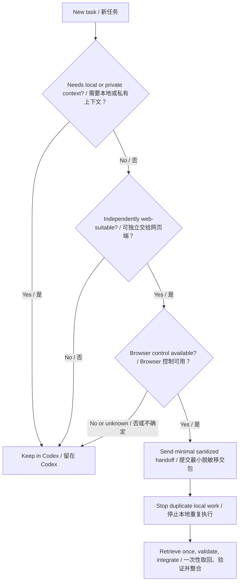

# Codex–ChatGPT Routing Template

A privacy-conscious bilingual prompt template for deciding whether work should stay in Codex, move to the ChatGPT web interface, or be split between them.

一套注重隐私的中英文提示词模板，用于自动判断任务应留在 Codex、转交 ChatGPT 网页端，还是拆分后分别处理。

> [!IMPORTANT]
> This repository provides copy-ready routing prompts and an optional defaults example. It does not install Browser control or authentication. The public template assumes every account is routing-eligible and delegates only when the current Codex host already provides usable Browser control.

## Why this exists / 项目目标

Some tasks benefit from a local coding agent with file, terminal, application, or server access. Other tasks—such as public research, synthesis, translation, and long-form writing—may be better handled in a general ChatGPT session. This template adds a routing gate before substantive work begins, minimizes data disclosure, and prevents both agents from doing the same work twice.

部分任务必须访问本地文件、终端、应用或服务器；公开资料研究、综合整理、翻译与长篇写作则可能更适合普通 ChatGPT 会话。本模板在实质工作开始前执行路由判断，并通过最小披露和单一执行规则避免隐私泄露与重复消耗。

## Routing model / 路由模型

## Repository contents / 仓库内容

- [Chinese prompt / 中文提示词](prompts/router.zh-CN.md)
- [English prompt / 英文提示词](prompts/router.en.md)
- [Optional defaults example / 可选默认值示例](examples/config.example.yaml)
- [Security policy / 安全说明](SECURITY.md)
- [MIT License](LICENSE)

## Quick start / 快速开始

1. Choose a language and paste the complete prompt directly into Codex personalization, project instructions, or `AGENTS.md`.
2. No placeholder replacement, account checker, or private configuration is required.
3. Use a Codex host that already exposes Browser control if you want automatic ChatGPT-web delegation. Without it, tasks safely stay in Codex.
4. Test with non-sensitive sample tasks before using the router with real work.

1. 选择中文或英文版本，将完整提示词直接复制到 Codex 个性化指令、项目指令或 `AGENTS.md`。
2. 无需替换占位符，无需账号检查器，也无需安装私有配置。
3. 若要自动转交 ChatGPT 网页端，当前 Codex 宿主必须已经提供 Browser 控制；没有该能力时，任务会安全留在 Codex。
4. 先用无敏感信息的示例任务测试，再用于真实工作。

`examples/config.example.yaml` only documents the prompt's defaults. The pasted prompt does not read it automatically, and normal use does not require copying or editing it. Never put secrets in that file.

`examples/config.example.yaml` 只用于说明提示词采用的默认值。直接复制的提示词不会自动读取该文件，正常使用也不需要复制或修改它。切勿在其中写入秘密。

## Example decisions / 判断示例

| Request | Route | Reason |
|---|---|---|
| Summarize public reports without private context | ChatGPT web, when Browser control is available | Independent public-information work |
| Fix and test code in a local repository | Codex | Requires local files and execution |
| Research public alternatives, then modify private code | Split | Public research can be handed off; implementation stays local |
| Analyze an unpublished dataset | Codex | Private data must not be disclosed |

## Safety defaults / 安全默认值

- Assume every account is routing-eligible; do not inspect account identity, plan, or quota.
- Keep work local when Browser control is missing, unavailable, or uncertain.
- Send only the minimum sanitized context required for the delegated task.
- Never send credentials, session data, personal information, unpublished material, or complete private code.
- After a handoff, do not repeat the same research or writing locally.
- Sign-in, account switching, verification, payment, private-file upload, and public publishing require explicit user confirmation.
- A queued web task is not a failure; one explicit retry is allowed by default, then the workflow stops and reports the problem.

## Limitations / 局限

- A prompt cannot create missing Browser-control capabilities.
- This public template intentionally performs no account-entitlement check. Users are responsible for confirming that their current product access and usage rules permit the intended route.
- ChatGPT and Codex interfaces, product rules, models, and usage accounting can change. Verify them from official sources before relying on a route.
- Automatic classification can be wrong. Keep human confirmation for sensitive or consequential actions.
- This template is an operational starting point, not a security boundary or compliance certification.

## License and trademarks

Released under the [MIT License](LICENSE). This community project is not affiliated with or endorsed by OpenAI. Codex, ChatGPT, and OpenAI are trademarks of their respective owner.
